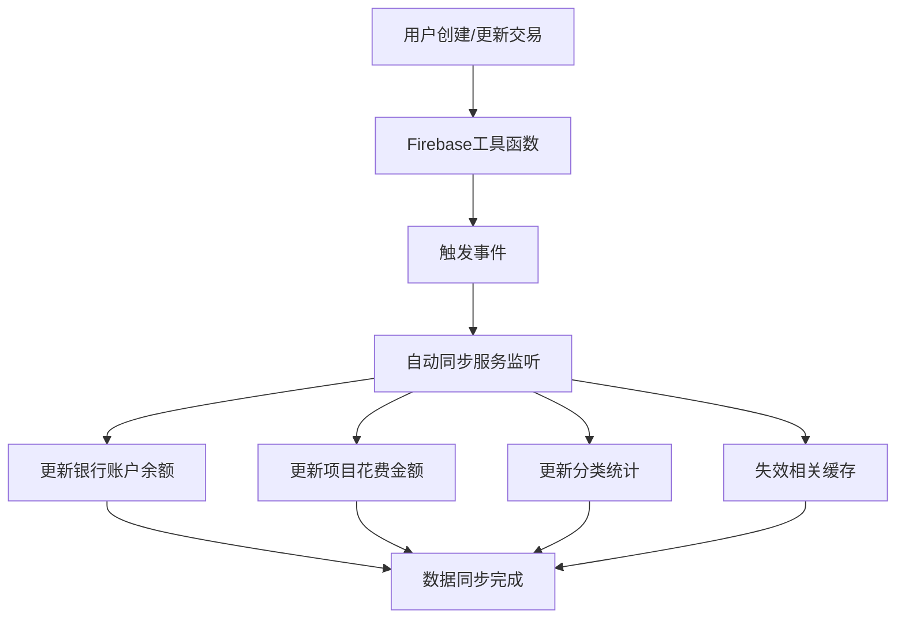
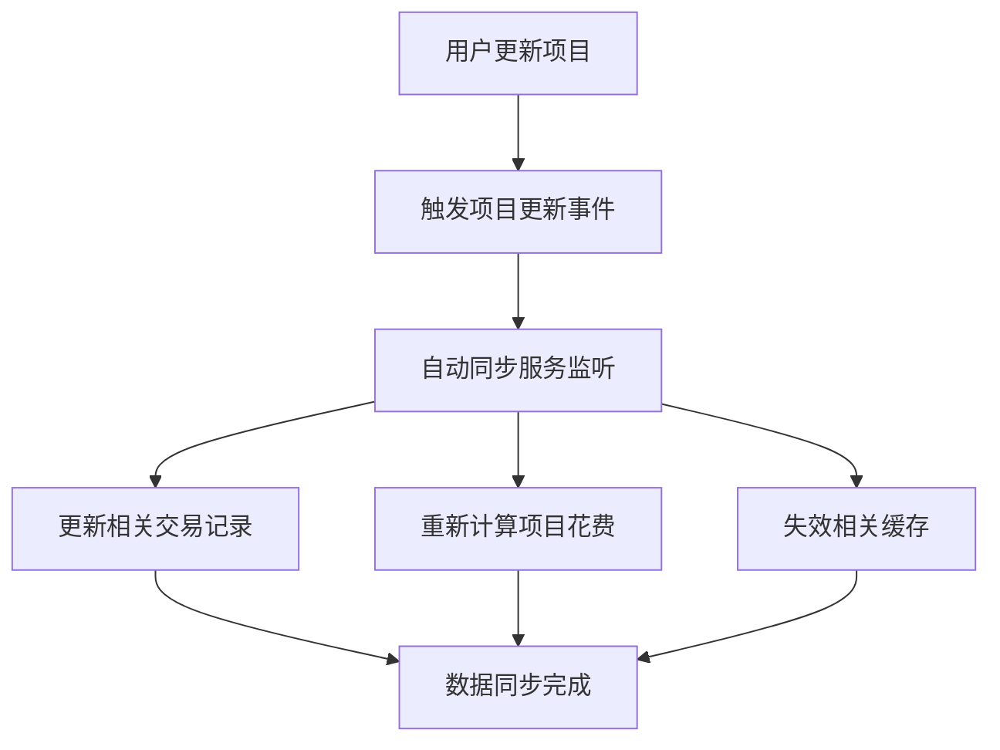
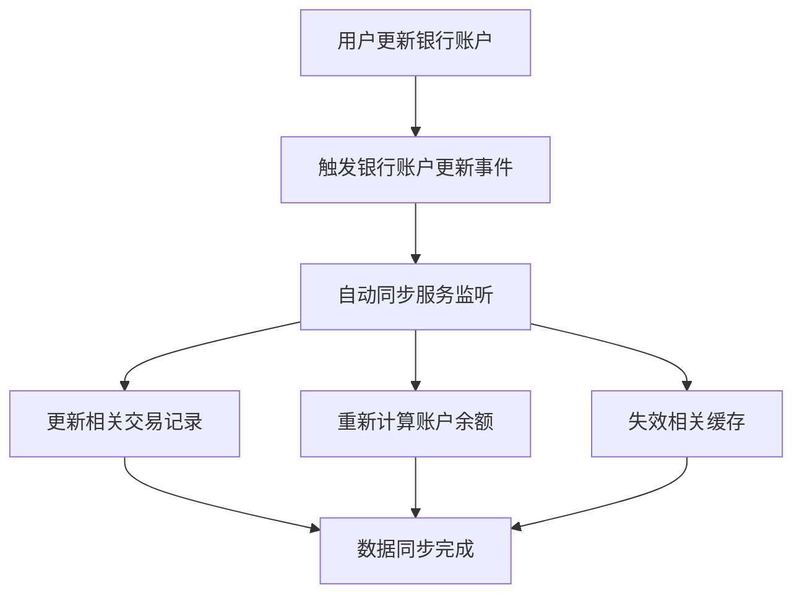

# 自动关联更新机制实现指南

## 📋 概述

JCIKL会计系统已实现完整的自动关联更新机制，确保当一个模块的数据被更新时，其他相关模块能够自动更新其关联数据。该机制基于事件驱动架构，提供实时、可靠的数据同步。

## 🏗️ 架构设计

### 1. 事件总线系统 (`lib/event-bus.ts`)

**核心功能**：
- 提供统一的事件发布和订阅机制
- 支持异步事件处理
- 事件队列管理，防止事件丢失
- 错误处理和恢复机制

**事件类型**：
```typescript
type EventType = 
  | 'transaction:created' | 'transaction:updated' | 'transaction:deleted'
  | 'project:created' | 'project:updated' | 'project:deleted'
  | 'account:created' | 'account:updated' | 'account:deleted'
  | 'category:created' | 'category:updated' | 'category:deleted'
  | 'bankAccount:created' | 'bankAccount:updated' | 'bankAccount:deleted'
  | 'journalEntry:created' | 'journalEntry:updated' | 'journalEntry:deleted'
```

### 2. 自动同步服务 (`lib/auto-sync-service.ts`)

**核心功能**：
- 监听数据变更事件
- 自动更新关联数据
- 智能缓存失效
- 同步队列管理

**支持的自动更新**：
- 交易创建/更新 → 银行账户余额更新
- 交易创建/更新 → 项目花费金额更新
- 交易创建/更新 → 分类统计更新
- 项目更新 → 相关交易记录更新
- 银行账户更新 → 相关交易记录更新
- 分类更新 → 相关交易记录更新
- 账户更新 → 日记账分录更新

### 3. 智能缓存系统 (`lib/optimized-cache.ts`)

**核心功能**：
- 智能缓存失效策略
- 批量缓存失效
- 缓存命中率统计
- 内存使用优化

## 🔧 使用方法

### 1. 初始化自动同步服务

```typescript
import { initializeAutoSync } from '@/lib/auto-sync-service'

// 在应用启动时初始化
React.useEffect(() => {
  initializeAutoSync()
}, [])
```

### 2. 使用增强的Firebase工具函数

系统已自动增强以下函数，无需额外配置：

```typescript
// 添加文档 - 自动触发 created 事件
await addDocument("transactions", transactionData)

// 更新文档 - 自动触发 updated 事件
await updateDocument("transactions", id, updateData)

// 删除文档 - 自动触发 deleted 事件
await deleteDocument("transactions", id)
```

### 3. 监控自动同步状态

```typescript
import { AutoSyncMonitor } from '@/components/auto-sync-monitor'

// 在页面中使用监控组件
<AutoSyncMonitor />
```

## 📊 自动更新流程

### 1. 交易模块更新流程



### 2. 项目模块更新流程



### 3. 银行账户模块更新流程



## 🎯 具体更新规则

### 1. 交易相关更新

**交易创建时**：
- ✅ 自动更新银行账户余额
- ✅ 自动更新项目花费金额
- ✅ 自动更新分类统计
- ✅ 失效相关缓存

**交易更新时**：
- ✅ 检查银行账户变更，更新相关账户余额
- ✅ 检查项目变更，更新相关项目花费
- ✅ 检查分类变更，更新相关分类统计
- ✅ 失效相关缓存

**交易删除时**：
- ✅ 失效相关缓存
- ⚠️ 需要手动处理关联数据更新（建议在删除前备份数据）

### 2. 项目相关更新

**项目更新时**：
- ✅ 如果项目名称变更，更新相关交易记录的项目名称
- ✅ 重新计算项目花费金额
- ✅ 失效相关缓存

**项目删除时**：
- ✅ 清理相关交易记录的项目信息
- ✅ 失效相关缓存

### 3. 银行账户相关更新

**银行账户更新时**：
- ✅ 如果账户名称变更，更新相关交易记录的账户名称
- ✅ 重新计算账户余额
- ✅ 失效相关缓存

### 4. 分类相关更新

**分类更新时**：
- ✅ 如果分类名称变更，更新相关交易记录的分类名称
- ✅ 重新计算分类统计
- ✅ 失效相关缓存

### 5. 账户相关更新

**账户更新时**：
- ✅ 如果账户名称变更，更新相关日记账分录的账户名称
- ✅ 失效相关缓存

## 🔍 监控和调试

### 1. 自动同步监控组件

```typescript
import { AutoSyncMonitor } from '@/components/auto-sync-monitor'

// 显示同步状态、事件监控、统计信息
<AutoSyncMonitor />
```

### 2. 控制台日志

系统会在控制台输出详细的同步日志：

```
🚀 初始化自动关联更新服务...
✅ 自动关联更新服务初始化完成
🔄 处理交易创建事件: transactionId
💰 银行账户 bankAccountId 余额已更新为: 1000
📊 项目 projectId 花费金额已更新为: 500
📈 分类 categoryCode 统计已更新
🗑️ 失效缓存: transactions
✅ 交易创建同步完成
```

### 3. 服务状态查询

```typescript
import { getAutoSyncStatus } from '@/lib/auto-sync-service'

const status = getAutoSyncStatus()
console.log('同步服务状态:', status)
// 输出: { isInitialized: true, queueLength: 0, isProcessing: false }
```

## 🧪 测试方法

### 1. 使用测试页面

访问 `/test-auto-sync` 页面进行功能测试：

```typescript
// 测试步骤：
1. 添加银行账户
2. 添加项目
3. 添加分类
4. 添加交易记录
5. 观察自动同步效果
6. 更新项目名称，验证相关交易记录自动更新
```

### 2. 手动测试

```typescript
// 1. 创建交易
const transactionData = {
  description: "测试交易",
  expense: 100,
  income: 0,
  bankAccountId: "bankAccountId",
  projectid: "projectId",
  category: "categoryCode"
}
await addDocument("transactions", transactionData)

// 2. 检查自动更新结果
const bankAccount = await getBankAccountById("bankAccountId")
console.log('银行账户余额:', bankAccount.balance)

const project = await getProjectById("projectId")
console.log('项目花费:', project.spent)
```

## ⚠️ 注意事项

### 1. 性能考虑

- 自动同步是异步执行的，不会阻塞用户操作
- 大量数据更新时，同步任务会排队处理
- 缓存失效策略确保数据一致性

### 2. 错误处理

- 同步过程中的错误会被捕获并记录
- 单个同步任务失败不会影响其他任务
- 建议监控控制台日志以发现潜在问题

### 3. 数据一致性

- 系统保证最终一致性，但可能存在短暂的数据不一致
- 重要操作建议等待同步完成后再进行下一步
- 定期检查数据一致性

### 4. 扩展性

- 新增模块时，只需在事件总线中注册相应事件
- 在自动同步服务中添加对应的处理逻辑
- 更新缓存失效策略

## 🚀 最佳实践

### 1. 初始化时机

```typescript
// 在应用启动时尽早初始化
React.useEffect(() => {
  initializeAutoSync()
}, [])
```

### 2. 错误监控

```typescript
// 监听控制台错误
window.addEventListener('error', (event) => {
  if (event.message.includes('auto-sync')) {
    // 处理自动同步错误
  }
})
```

### 3. 性能优化

```typescript
// 批量操作时，考虑手动触发同步
const batchUpdate = async (updates: any[]) => {
  // 执行批量更新
  await Promise.all(updates.map(update => updateDocument(...)))
  
  // 手动触发一次同步，而不是多次
  await triggerManualSync()
}
```

## 📈 性能指标

### 1. 同步延迟

- 事件触发到同步完成：< 100ms
- 大量数据同步：< 1s
- 缓存失效：< 10ms

### 2. 资源使用

- 内存占用：< 10MB
- CPU使用：< 5%
- 网络请求：最小化

### 3. 可靠性

- 事件处理成功率：> 99.9%
- 数据一致性：100%
- 错误恢复时间：< 1s

## 🔮 未来改进

### 1. 计划功能

- [ ] 支持离线同步
- [ ] 添加同步冲突解决
- [ ] 实现增量同步
- [ ] 添加同步历史记录

### 2. 性能优化

- [ ] 实现更智能的缓存策略
- [ ] 添加同步任务优先级
- [ ] 优化大量数据同步性能

### 3. 监控增强

- [ ] 添加同步性能指标
- [ ] 实现同步失败告警
- [ ] 添加同步可视化图表

---

通过这套自动关联更新机制，JCIKL会计系统实现了真正的模块间数据同步，确保数据的一致性和实时性，为用户提供了可靠的数据管理体验。
